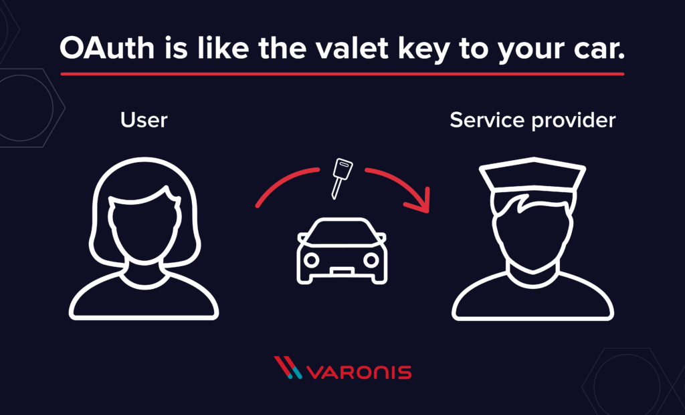

# What is OAuth? Definition and How it Works

OAuth (Open Authentication) is an open-standard authorization protocol or framework that provides applications the ability for “secure designated access.” It is a way for users to grant websites or applications access to their information without giving away their passwords.

# What is OAuth?
OAuth is an open-standard authorization protocol or framework that provides applications the ability for “secure designated access.” For example, you can tell Facebook that it’s OK for ESPN.com to access your profile or post updates to your timeline without having to give ESPN your Facebook password. This minimizes risk in a major way: In the event ESPN suffers a breach, your Facebook password remains safe.

OAuth doesn’t share password data but instead uses authorization tokens to prove an identity between consumers and service providers. OAuth is an authentication protocol that allows you to approve one application interacting with another on your behalf without giving away your password.

# SAML vs. OAuth

SAML (Security Assertion Markup Language) is an alternative federated authentication standard that many enterprises use for Single-Sign On (SSO). SAML enables enterprises to monitor who has access to corporate resources.

There are many differences between SAML and OAuth. SAML uses XML to pass messages, and OAuth uses JSON. OAuth provides a simpler mobile experience, while SAML is geared towards enterprise security. That last point is a key differentiator: OAuth uses API calls extensively, which is why mobile applications, modern web applications, game consoles, and Internet of Things (IoT) devices find OAuth a better experience for the user. SAML, on the other hand, drops a session cookie in a browser that allows a user to access certain web pages – great for short-lived work days, but not so great when have to log into your thermostat every day.

# OAuth Examples
The simplest example of OAuth in action is one website saying “hey, do you want to log into our website with other website’s login?” In this scenario, the only thing the first website – let’s refer to that website as the consumer – wants to know is that the user is the same user on both websites and has logged in successfully to the service provider – which is the site the user initially logged into, not the consumer.

Facebook apps are a good OAuth use case example. Say you’re using an app on Facebook, and it asks you to share your profile and pictures. Facebook is, in this case, the service provider: it has your login data and your pictures. The app is the consumer, and as the user, you want to use the app to do something with your pictures. You specifically gave this app access to your pictures, which OAuth is managing in the background.

Your smart home devices – toaster, thermostat, security system, etc. – probably use some kind of login data to sync with each other and allow you to administer them from a browser or client device. These devices use what OAuth calls confidential authorization. That means they hold onto the secret key information, so you don’t have to log in over and over again.

# OAuth Explained

OAuth is about authorization and not authentication. Authorization is asking for permission to do stuff. Authentication is about proving you are the correct person because you know things. OAuth doesn’t pass authentication data between consumers and service providers – but instead acts as an authorization token of sorts.

The common analogy I’ve seen used while researching OAuth is the valet key to your car. The valet key allows the valet to start and move the car but doesn’t give them access to the trunk or the glove box.

An OAuth token is like that valet key. As a user, you get to tell the consumers what they can use and what they can’t use from each service provider. You can give each consumer a different valet key. They never have the full key or any of the private data that gives them access to the full key.

# How OAuth Works

There are 3 main players in an OAuth transaction: the user, the consumer, and the service provider.  This triumvirate has been affectionately deemed the OAuth Love Triangle.

In our example, Joe is the user, Bitly is the consumer, and Twitter is the service provided who controls Joe’s secure resource (his Twitter stream).  Joe would like Bitly to be able to post shortened links to his stream.  Here’s how it works:

**Step 1 – The User Shows Intent**

**Joe (User)**: “Hey, Bitly, I would like you to be able to post links directly to my Twitter stream.”
**Bitly (Consumer)**: “Great! Let me go ask for permission.”

**Step 2 – The Consumer Gets Permission**

**Bitly**: “I have a user that would like me to post to his stream. Can I have a request token?”
**Twitter (Service Provider)**: “Sure.  Here’s a token and a secret.”

The secret is used to prevent request forgery.  The consumer uses the secret to sign each request so that the service provider can verify it is actually coming from the consumer application.

**Step 3 – The User Is Redirected to the Service Provider**

**Bitly**: “OK, Joe.  I’m sending you over to Twitter so you can approve.  Take this token with you.”
**Joe**: “OK!”
- **Bitly directs Joe to Twitter for authorization>**

This is the scary part. If Bitly were super-shady Evil Co. it could pop up a window that looked like Twitter but was really phishing for your username and password.  Always be sure to verify that the URL you’re directed to is actually the service provider (Twitter, in this case).

**Step 4 – The User Gives Permission**

**Joe**: “Twitter, I’d like to authorize this request token that Bitly gave me.”
**Twitter**: “OK, just to be sure, you want to authorize Bitly to do X, Y, and Z with your Twitter account?”
**Joe**: “Yes!”
**Twitter**: “OK, you can go back to Bitly and tell them they have permission to use their request token.”

Twitter marks the request token as “good-to-go,” so when the consumer requests access, it will be accepted (so long as it’s signed using their shared secret).

**Step 5 – The Consumer Obtains an Access Token**

**Bitly**: “Twitter, can I exchange this request token for an access token?”
**Twitter**: “Sure.  Here’s your access token and secret.”

**Step 6 – The Consumer Accesses the Protected Resource**

**Bitly**: “I’d like to post this link to Joe’s stream.  Here’s my access token!”
**Twitter**: “Done!”

In our scenario, Joe never had to share his Twitter credentials with Bitly.  He simply delegated access using OAuth in a secure manner.  At any time, Joe can login to Twitter and review the access he has granted and revoke tokens for specific applications without affecting others.  OAuth also allows for granular permission levels.  You can give Bitly the right to post to your Twitter account, but restrict LinkedIn to read-only access.

# OAuth 1.0 vs. OAuth 2.0

OAuth 2.0 is a complete redesign from OAuth 1.0, and the two are not compatible. If you create a new application today, use OAuth 2.0. This blog only applies to OAuth 2.0, since OAuth 1.0 is deprecated.

OAuth 2.0 is faster and easier to implement. OAuth 1.0 used complicated cryptographic requirements, only supported three flows, and did not scale.

OAuth 2.0, on the other hand, has six flows for different types of applications and requirements and enables signed secrets over HTTPS. OAuth tokens no longer need to be encrypted on the endpoints in 2.0 since they are encrypted in transit.

